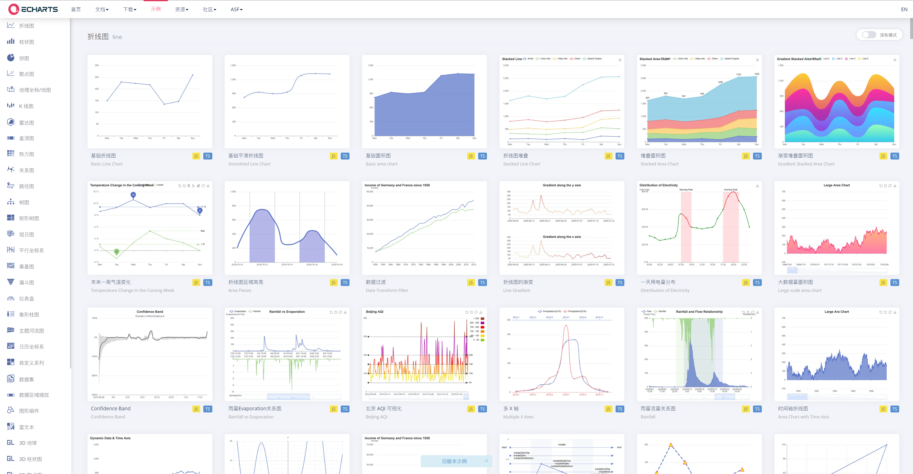

# 说明

## 参考

+ `Echarts`  表格类型、格式类目全，可以参考其做数据展示（ [地址](https://echarts.apache.org/examples/zh/index.html)）

+ `Multiple Graph And Chart UI` （[资源商店地址](https://assetstore.unity.com/packages/2d/gui/multiple-graph-and-chart-ui-pack-198835)），有一些基础的效果，做初期演示demo用这个比较方便，后期如果要接数据其拓展性不是很好，建议还是自己写

+ `XCharts`  好像是国内的开发团队做的一款插件，其功能比较全，也支持动态数据的演示，有一定基础可以用这个（[github地址](https://github.com/XCharts-Team/XCharts)）

  

+  `Graph And Chart` 插件，暂未研究，亮点是支持三维图表格式的展示

  > 适用于 Unity 的顶级 2D/3D 数据可视化。美观度、响应度和互动性。易于使用和快速设置。每项功能都可以从代码和编辑器中自定义。“图形和图表”兼容任何平台，包**括 VR/AR、移动端、网页和桌面**端。支持所有最新的 Unity 版本。与 UI Canvas 集成。

  

+ `Customizable SciFi Holo Interface`  科幻风UI插件，带有动画效果，[资源商店地址](https://assetstore.unity.com/packages/2d/textures-materials/customizable-scifi-holo-interface-69794)

+ 